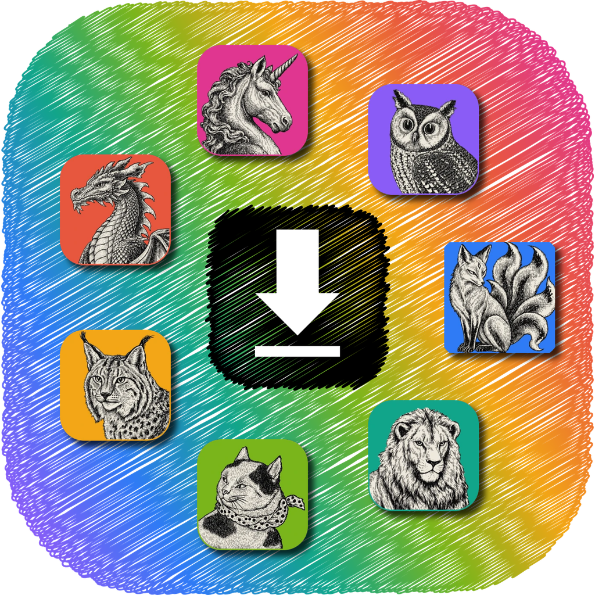
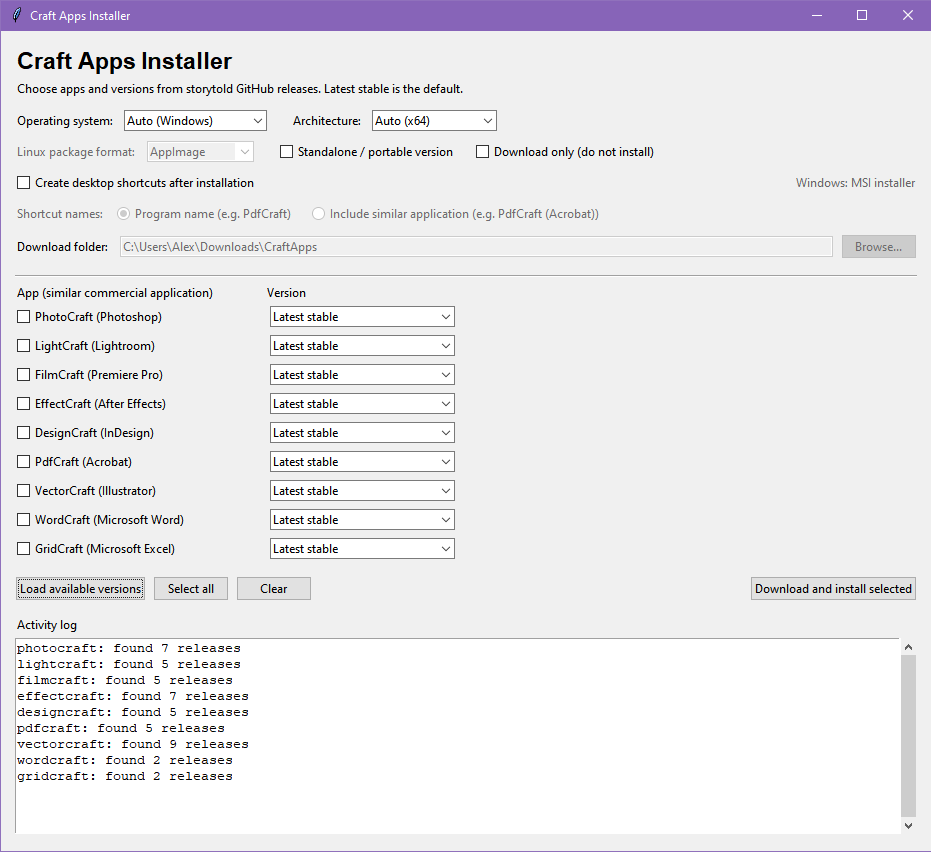

# Craft Apps Installer

A cross-platform graphical downloader and installer for the [storytold](https://github.com/storytold) Craft applications: PhotoCraft, LightCraft, FilmCraft, EffectCraft, DesignCraft, PDFCraft, VectorCraft, WordCraft, GridCraft, and DeckCraft.



This project is an independent downloader and is **not affiliated with, endorsed by, or maintained by storytold or the companies behind the comparable commercial applications**.



## Download

**Code signing status:** Windows releases are currently unsigned. This project is applying to the [SignPath Foundation](https://signpath.org/) for free Windows code signing. If accepted, future Windows releases will use SignPath.io with a certificate provided by SignPath Foundation. See the [Code signing policy](#code-signing-policy) below.

Download the latest standalone builds from [Releases](../../releases) when available. Recipients do not need to install Python.

| Platform | Release download |
| --- | --- |
| Windows (x64) | `CraftAppsInstaller-Windows.exe` |
| macOS (Intel) | `CraftAppsInstaller-macOS-Intel.zip` |
| macOS (Apple Silicon) | `CraftAppsInstaller-macOS-AppleSilicon.zip` |

On macOS, unzip the archive and launch `CraftAppsInstaller.app`. These initial builds are unsigned and may encounter macOS Gatekeeper or Windows SmartScreen warnings. Only run downloads you trust.

## Features

- Choose one or more Craft apps and optionally select a specific release (latest stable by default).
- **Check for Updates** discovers installed Craft apps, compares identifiable versions with the latest stable releases, and lets you choose which confirmed updates to install. Successful installs are tracked locally; existing MSI, macOS app bundles, and Linux package installs can be discovered too. Unknown versions are reported rather than force-updated.
- Automatically detect the operating system and CPU architecture, with manual overrides for download-only use.
- Select normal installers or standalone/portable packages where release assets support them.
- Download only to a selected folder, or install automatically and remove temporary installer packages.
- Optionally create desktop shortcuts pointing to the installed applications, with either short program names or names that include comparable commercial apps.
- macOS universal packages and Linux DEB, RPM, AppImage, Flatpak, and tarball selection, subject to what each upstream release actually provides.

## Run from Python source

Python 3.9+ with Tkinter is required only to run the source directly:

```bash
python CraftAppsInstaller.py
```

On some Linux distributions, Tkinter must be installed separately.

## Automated builds and releases

The workflow in `.github/workflows/build.yml` creates a Windows x64 executable plus native macOS Intel and Apple Silicon application archives using PyInstaller.

- Pushes to `main` and manual workflow dispatch create downloadable **Actions artifacts**.
- Pushing a version tag starting with `v` (for example `v1.0.0`) builds all three targets and publishes a **GitHub Release** when all builds succeed.

Example release commands:

```bash
git tag v1.0.0
git push origin v1.0.0
```

Find CI build logs and artifacts in the repository's **Actions** tab. Publishing requires GitHub Actions to be enabled, and release creation requires the workflow token's `contents: write` permission (granted to its release job).

Builds are not code-signed or notarized. Automatic installations can request operating-system administrator privileges. Windows and macOS behavior should be tested on each target platform before wide distribution.

## Code signing policy

**Status:** Application to SignPath Foundation pending. Existing releases are unsigned; displaying this policy does not mean any binary has already been signed or endorsed.

**SignPath acknowledgment:** Free code signing provided by [SignPath.io](https://signpath.io/), certificate by [SignPath Foundation](https://signpath.org/) (planned, subject to acceptance).

**Code signing and release process:** The installer is built from this public GitHub repository with GitHub-hosted GitHub Actions. If accepted into the program, future Windows releases intended for publication will be submitted for verified signing, with a separate manual approval for each release. Only project-owned build artifacts will be submitted; downloaded Craft applications will not be signed using this project's certificate.

**Project team roles:**
- **Committers and reviewers:** [@inspiired-av](https://github.com/inspiired-av) (repository maintainer). Contributions submitted by others are to be reviewed before merging.
- **Code signing approver:** [@inspiired-av](https://github.com/inspiired-av). Each release signing request requires explicit manual approval.
- Maintainers with release/signing access are required to enable multi-factor authentication on GitHub and SignPath.

**Privacy policy:** Craft Apps Installer does not collect analytics or telemetry. It contacts GitHub to retrieve release information and to download packages only when requested by the person operating the installer (for example, using **Load available versions**, **Check for Updates**, or an installation/download command). Normal network-level information, such as the requesting IP address, may be visible to GitHub. Installation tracking records are stored locally on the user's device, not sent to the maintainers. The installer does not transmit any other information to networked systems without a user-initiated action. Consult [GitHub's privacy statement](https://docs.github.com/en/site-policy/privacy-policies/github-general-privacy-statement) for GitHub API and download interactions.

## License

The original installer source code is available under the [MIT License](LICENSE). For details about the supplied app artwork and upstream Crafting Apps' icon licensing, see [ATTRIBUTION.md](ATTRIBUTION.md). The repository's MIT license does not relicense third-party artwork, trademarks, or applications downloaded by this installer.
